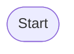

<!-- See docs/report-template.md for the full guide on how to fill this in.
     Run `npm run workflow-viz` to regenerate workflow diagrams before filing. -->

## Summary

<!-- One paragraph: what was tested, which workflows, overall verdict. -->

**Period:** YYYY-MM-DD → YYYY-MM-DD
**Tested by:**
**Repo:** https://github.com/RaphaelManke/aws-durable-functions-otel-demo

---

## Environment

| Field | Value |
| :--- | :--- |
| `@aws/durable-execution-sdk-js` version | |
| `@aws/durable-execution-sdk-js-otel` version | |
| OTel provider | `dash0` / `adot` |
| Instrumentation layer | `dash0-extension-node:XX` / `AWSOpenTelemetryDistroJs:XX` |
| Lambda runtime | `nodejs22.x` |
| AWS region | `eu-central-1` |
| Dash0 dataset | `default` |

---

## Findings

> Severity: **Critical** (data loss / crash) · **High** (incorrect data) · **Medium** (missing data) · **Low** (cosmetic) · **Observation** (informational)

---

### [FIND-1] Title

- **Severity:**
- **Status:** Open / Investigating / Fixed in SDK vX.Y / Won't Fix
- **Category:** Trace quality · Missing spans · Attribute gaps · Sampling · Performance · SDK crash · Other

#### Description

#### Steps to reproduce

```bash
aws lambda invoke \
  --function-name durable-workflow:live \
  --invocation-type Event \
  --payload '{"name":"..."}' \
  --cli-binary-format raw-in-base64-out \
  --profile otel-playground \
  --region eu-central-1 \
  /tmp/out.json
```

#### Expected behaviour

#### Actual behaviour

#### Trace evidence

<!-- Paste Dash0 deep link + span tree -->

[View trace in Dash0](https://app.dash0.com/goto/traces/explorer?...)

```
durable-workflow  [SERVER]
└── handler
    └── invocation
        ├── step-name   ← issue here
        └── ...
```

#### Workflow diagram

<!-- Paste from workflow-viz/ or annotate inline -->



#### Screenshots

<!-- Drag and drop screenshots directly into this editor -->

#### Suggested fix / hypothesis

---

### [FIND-2] Title

<!-- Copy FIND-1 block and increment -->

---

## Positive findings

- ✅
- ✅

---

## Metrics summary

| Metric | Value |
| :--- | :--- |
| Total executions tested | |
| Successful executions | |
| Error rate | |
| p95 end-to-end duration | |
| Lambda invocations per execution (avg) | |
| Steps traced correctly | |
| Missing / incorrect spans | |

---

## Open questions for SDK team

- [ ]
- [ ]

---

## References

| Type | Link |
| :--- | :--- |
| Demo repo | https://github.com/RaphaelManke/aws-durable-functions-otel-demo |
| Workflow diagrams | https://github.com/RaphaelManke/aws-durable-functions-otel-demo/blob/main/WORKFLOWS.md |
| Dash0 service catalog | https://app.dash0.com/goto/services/catalog |
| Related SDK issue | |
| Related PR | |
