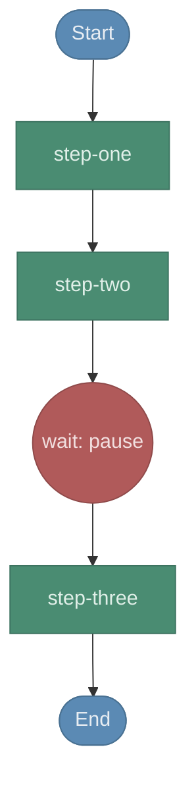
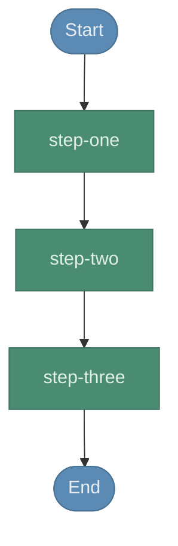
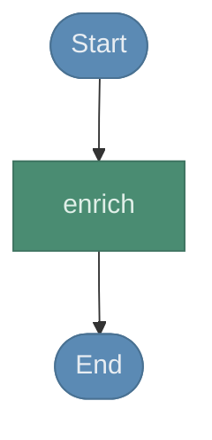
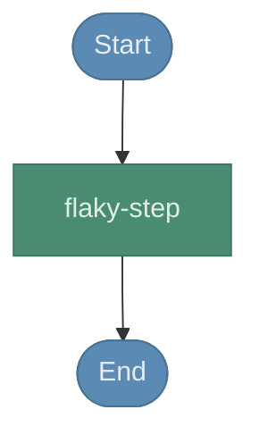
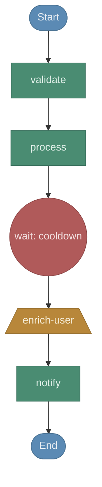

# Workflows

Auto-generated by `npm run workflow-viz`. Do not edit manually.

> Diagrams are produced by [durable-viz](https://github.com/gunnargrosch/durable-viz)
> via static analysis of the handler source — no deployment required.

---

## Lambda Chain Wait

**Source:** [`lambda-chain-wait/index.ts`](lambda-chain-wait/index.ts)

### Input

```typescript
interface ChainWaitEvent {
  input: string;
}
```

### Diagram



---

## Lambda Chain

**Source:** [`lambda-chain/index.ts`](lambda-chain/index.ts)

### Input

```typescript
interface ChainEvent {
  input: string;
}
```

### Diagram



---

## Lambda Child

**Source:** [`lambda-child/index.ts`](lambda-child/index.ts)

### Input

```typescript
interface EnrichEvent {
  userId: string;
  name: string;
}
```

### Diagram



---

## Lambda Retry

**Source:** [`lambda-retry/index.ts`](lambda-retry/index.ts)

### Input

```typescript
interface RetryEvent {
  input: string;
}
```

### Diagram



---

## Lambda

**Source:** [`lambda/index.ts`](lambda/index.ts)

### Input

```typescript
interface WorkflowEvent {
  name: string;
  email?: string;
}
```

### Diagram



---

