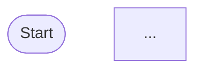

# OTel SDK Feedback Report — [Sprint / Milestone Name] [YYYY-MM-DD]

> **How to use this template**
> 1. Copy this file to `docs/reports/YYYY-MM-sprint-N.md` and fill it in.
> 2. Once ready, open a GitHub Issue using the **OTel SDK Feedback Report** issue template — it mirrors this structure.
> 3. Attach screenshots by dragging them into the GitHub issue editor.
> 4. Embed Dash0 trace links and Mermaid diagrams directly in the findings.
> 5. Run `npm run workflow-viz` to regenerate `workflow-viz/` diagrams before filing.

---

## Summary

<!-- One paragraph: what was tested this sprint, which functions/workflows, and the overall verdict. -->

**Period:** YYYY-MM-DD → YYYY-MM-DD
**Tested by:**
**Repo:** https://github.com/RaphaelManke/aws-durable-functions-otel-demo

---

## Environment

| Field | Value |
| :--- | :--- |
| `@aws/durable-execution-sdk-js` version | |
| `@aws/durable-execution-sdk-js-otel` version | |
| OTel provider | `dash0` / `adot` |
| Instrumentation layer | `dash0-extension-node:XX` / `AWSOpenTelemetryDistroJs:XX` |
| Lambda runtime | `nodejs22.x` |
| AWS region | `eu-central-1` |
| Dash0 dataset | `default` |

---

## Findings

> Severity scale: **Critical** (data loss / crash) · **High** (incorrect data) · **Medium** (missing data, degraded UX) · **Low** (cosmetic / nice-to-have) · **Observation** (no action needed, informational)

---

### [FIND-1] Title

- **Severity:** Critical / High / Medium / Low / Observation
- **Status:** Open / Investigating / Fixed in SDK vX.Y / Won't Fix
- **Category:** Trace quality · Missing spans · Attribute gaps · Sampling · Performance · SDK crash · Other

#### Description

<!-- What was observed. Be specific: which step, which invocation, which replay. -->

#### Steps to reproduce

```bash
aws lambda invoke \
  --function-name durable-workflow:live \
  --invocation-type Event \
  --payload '{"name":"..."}' \
  --cli-binary-format raw-in-base64-out \
  --profile otel-playground \
  --region eu-central-1 \
  /tmp/out.json
```

#### Expected behaviour

<!-- What should happen according to the SDK docs / OTel spec. -->

#### Actual behaviour

<!-- What actually happened. Include error messages, missing spans, wrong attribute values. -->

#### Trace evidence

<!-- Paste the Dash0 deep link and a span tree showing the issue. -->

[View trace in Dash0](https://app.dash0.com/goto/traces/explorer?...)

```
durable-workflow  [SERVER]  Xms
└── handler  [INTERNAL]
    └── invocation  [INTERNAL]
        ├── step-name  [INTERNAL]   ← issue here
        └── ...
```

#### Workflow diagram

<!-- Paste the relevant diagram from workflow-viz/ or annotate it. -->



#### Screenshots

<!-- Drag and drop screenshots here. GitHub renders them inline.
     Save screenshots in docs/reports/assets/ for the repo copy. -->


#### Suggested fix / hypothesis

<!-- What you think the root cause is and how the SDK team might fix it. -->

---

### [FIND-2] Title

<!-- Copy the FIND-1 block and increment the number. -->

---

## Positive findings

<!-- What worked well this sprint. SDK behaviours that matched expectations. -->

- ✅ ...
- ✅ ...

---

## Metrics summary

| Metric | Value |
| :--- | :--- |
| Total executions tested | |
| Successful executions | |
| Failed executions | |
| Error rate | |
| p95 end-to-end duration | |
| Lambda invocations per execution (avg) | |
| Steps traced correctly | |
| Missing / incorrect spans | |

---

## Open questions for SDK team

<!-- Things that need clarification from the SDK authors. Use checkboxes so they can be ticked off. -->

- [ ] Question 1
- [ ] Question 2

---

## References

| Type | Link |
| :--- | :--- |
| Demo repo | https://github.com/RaphaelManke/aws-durable-functions-otel-demo |
| Workflow diagrams | [WORKFLOWS.md](../WORKFLOWS.md) |
| Dash0 service catalog | https://app.dash0.com/goto/services/catalog |
| Related SDK issue | |
| Related PR | |
